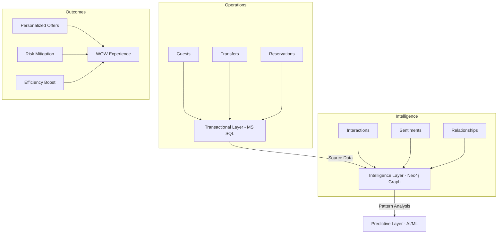

# GuestFlow — Tourism Operations Intelligence Layer


[]()
[]()
[](LICENSE)
[](https://dotnet.microsoft.com/download/dotnet/8.0)
[](https://reactjs.org/)

> **"GuestFlow acts as the Memory of Human Relations for 5-star hotels."**

GuestFlow is an enterprise-grade Guest Management and Operations platform. Unlike traditional PMS systems that focus on transactions, GuestFlow captures the **human story** behind every interaction, transforming guest staff services into a graph-based intelligence layer.

---

## 🏛 Platform Ecosystem & Intelligence

GuestFlow follows a triple-layer data architecture to ensure both operational stability and intelligent foresight.



---

## 🎬 Product Demo (v1.5.0 Release)

Experience the fluid, high-performance interface of GuestFlow v1.5.0.


---

## 🌟 Visual Gallery (Operational Suite)

### 🧹 Real-time Housekeeping Panel
Manage room status with a clean, grid-based interface. Track cleaning progress and assignments in real-time.


### 🛠 Technical Maintenance Tracker
Ensure technical excellence with centralized issue tracking and prompt resolution protocols.


### 📦 Lost & Found Inventory Hub
Transform guest accidents into 'WOW' moments with automated lost item management and return tracking.


---

## 🧠 Key Capabilities

### 🏢 Intelligence & Relationships

- **Human Relations Memory**: Tracks every touchpoint between guests and staff.
- **Sentiment Analysis**: Automatic mood detection from communication channels.
- **Graph Intelligence**: Maps complex relationships between guests, services, and time.

### 🏨 Concierge & Operational Hub

- **Unified Guest Profile**: 360-degree view combining PMS data and GuestFlow behavioral history.
- **Service Hub**: Automated management of Transfers, Tours, and Restaurant bookings.
- **Operations Suite**: Integrated **Housekeeping**, **Maintenance**, and **Lost & Found** management.

### 🔌 Enterprise Integrations

- **PMS Sync**: Native connectors for **Opera Cloud** and **Elektraweb**.
- **OTA Channel Manager**: Real-time availability sync with Booking.com and Expedia.
- **Financial Ledger**: Automated journal entries for ERP systems (SAP, Oracle, etc.).

---

## 🛠 Technology Stack

| Category | Technology |
| :--- | :--- |
| **Backend** | .NET 8 (C# 11), Web API, EF Core 8 |
| **Frontend** | React 18, TypeScript, Vite, Material UI 5 |
| **Intelligence** | Neo4j (Graph DB), ML.NET (Predictive Analytics) |
| **Deployment** | Docker, Nginx (Reverse Proxy), GitHub Actions |

---

## 🚀 Quick Start (Dockerized)

Ensure you have [Docker](https://www.docker.com/) and [Docker Compose](https://docs.docker.com/compose/) installed.

```bash
git clone https://github.com/furkancengiz6/GuestFlow.git
cd GuestFlow
docker-compose up -d --build
```

Access the application at `http://localhost`.

---

## ⚖️ License & Copyright

This project is licensed under the MIT License - see the [LICENSE](LICENSE) file for details.

Copyright (c) 2026 **Furkan Cengiz**
