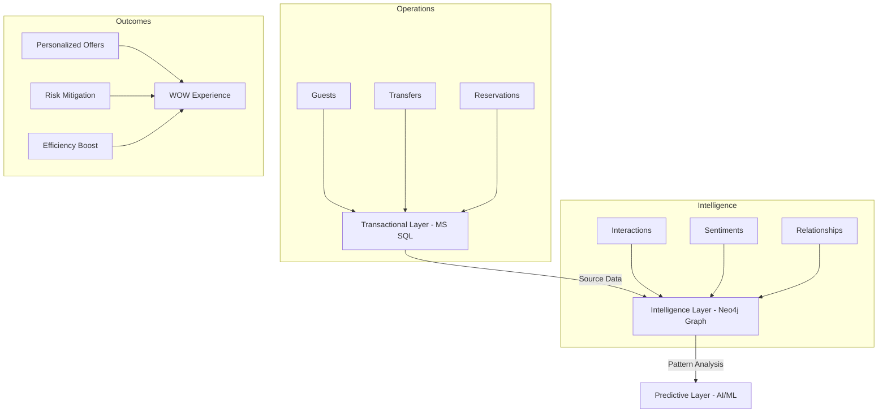

# GuestFlow — Tourism Operations Intelligence Layer

[]()
[](LICENSE)
[](https://dotnet.microsoft.com/download/dotnet/8.0)
[](https://reactjs.org/)
[](https://www.typescriptlang.org/)

> **"GuestFlow acts as the Memory of Human Relations for 5-star hotels."**

GuestFlow is an enterprise-grade Guest Management and Operations platform. Unlike traditional PMS systems that focus on transactions, GuestFlow captures the **human story** behind every interaction, transforming guest staff services into a graph-based intelligence layer.

---

## 🏛 Platform Ecosystem & Intelligence

GuestFlow follows a triple-layer data architecture to ensure both operational stability and intelligent foresight.



---

## 🌟 Key Capabilities

### 🧠 Intelligence & Relationships

- **Human Relations Memory**: Tracks every touchpoint between guests and staff.
- **Sentiment Analysis**: Automatic mood detection from communication channels.
- **Graph Intelligence**: Maps complex relationships between guests, services, and time.

### 🏨 Concierge & Front Office

- **Unified Guest Profile**: 360-degree view combining PMS data and GuestFlow behavioral history.
- **Service Hub**: Automated management of Transfers, Tours (City/Yacht), and Restaurant bookings.
- **Real-time Monitoring**: Built-in health checks and structured logging for 99.9% uptime.

### 🔌 Enterprise Integrations

- **PMS Sync**: Native connectors for **Opera Cloud** and **Elektraweb**.
- **OTA Channel Manager**: Real-time availability sync with Booking.com and Expedia.
- **Financial Ledger**: Automated journal entries for ERP systems (SAP, Oracle, etc.).

---

## 🛠 Technology Stack

| Category | Technology |
| :--- | :--- |
| **Backend** | .NET 8 (C# 11), Web API, EF Core 8 |
| **Frontend** | React 18, TypeScript, Vite, Material UI (MUI) 5 |
| **Intelligence** | Neo4j (Graph DB), ML.NET (Predictive) |
| **Real-time** | SignalR, WebSocket |
| **Reporting** | QuestPDF, ClosedXML (Excel/CSV) |
| **Security** | JWT-based RBAC, PII Sanitization, AES-256 |

---

## 🚀 Quick Start

### Prerequisites

- [.NET 8.0 SDK](https://dotnet.microsoft.com/download/dotnet/8.0)
- [Node.js](https://nodejs.org/) (LTS)
- SQL Server (LocalDB or Enterprise)

### 1. Clone & Setup Backend

```bash
git clone https://github.com/furkancengiz6/GuestFlow.git
cd GuestFlow
# Update connection string in appsettings.json if needed
dotnet ef database update --project GuestFlow.Persistence
dotnet run --project GuestFlow.Api
```

### 2. Setup Frontend

```bash
cd GuestFlow.Frontend
npm install
npm run dev
```

---

## 📚 Documentation

Detailed guides for various project aspects:

- [📖 **Vision & AI Layer**](VISION_TURIZM_INTELLIGENCE_LAYER.md)
- [⚙️ **Technical Specifications**](docs/TECHNICAL_SPECIFICATIONS.md)
- [🛠 **Tech Stack & Libraries**](docs/TECH_STACK.md)
- [📡 **API Documentation**](docs/API.md)
- [🚢 **Deployment Guide**](docs/DEPLOYMENT.md)
- [🧪 **Testing Framework**](docs/TESTING.md)

---

## 🛣 Roadmap

We are currently at **94% completion**. Key remaining focus:

- [x] CRM & Concierge Core
- [x] Financial Integration
- [x] Graph Intelligence Layer
- [/] Advanced AI Predictions & ML Integration

See [ROADMAP.md](ROADMAP.md) for full details.

---

## ⚖️ License & Copyright

This project is licensed under the MIT License - see the [LICENSE](LICENSE) file for details.

Copyright (c) 2025 **Furkan Cengiz**

---


---


---
