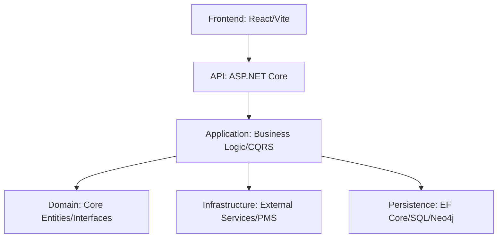

# GuestFlow Technical Specifications & Architecture

This document defines the high-level architecture, design patterns, and engineering principles governing the GuestFlow platform.

---

## 🏛 1. Architectural Blueprint: N-Tier Clean Architecture

GuestFlow is built using a decoupled, N-Layered approach to ensure maintainability, testability, and scalability.

### Core Layers

- **GuestFlow.Domain**: Zero-dependency layer containing Entities, Value Objects, and Domain Exceptions.
- **GuestFlow.Application**: Orchestration layer using **MediatR** for CQRS. Contains DTOs, Mappings, and Service interfaces.
- **GuestFlow.Persistence**: Implements the Data Access Layer via EF Core (SQL Server) and Neo4j (Graph).
- **GuestFlow.Infrastructure**: Handles cross-cutting concerns (Email, SMS, Storage, PMS Connectors).
- **GuestFlow.Api**: Presentation layer providing RESTful access and SignalR hubs.

---

## 🧠 2. The Triple-Layer Intelligence Model

Unlike traditional PMS/CRM systems, GuestFlow operates on three distinct data planes:

1. **Transactional Plane (SQL Server)**:
    - Focuses on ACID compliance for financial and booking records.
    - Handles billing, transfers, and user management.
2. **Relationship Plane (Neo4j)**:
    - Models the "Memory of Human Relations."
    - Maps nodes like `(Guest)-[LIKES]->(Activity)` or `(Staff)-[SERVED]->(Guest)`.
    - Enables complex graph queries for VIP recognition and service recovery.
3. **Predictive Plane (ML.NET)**:
    - Analyzes historical trends to forecast operational demand.
    - Performs sentiment analysis on guest communication touchpoints.

---

## 🔐 3. Security & Data Privacy Framework

### Identity & Access

- **Stateless Auth**: JWT-based authentication with secure Refresh Token rotation.
- **RBAC**: Role-Based Access Control mapped to granular application permissions.

### Compliance (GDPR/KVKK)

- **PII Governance**: Dedicated services for data masking and anonymization.
- **Audit Trails**: Every CRUD operation is logged with UserID, Timestamp, and IP Context.
- **Sanitization**: All HTML/Text input is processed via `Ganss.XSS`.

---

## 🚀 4. Deployment & DevOps Strategy

- **Containerization**: Native Docker support for both Backend and Frontend.
- **Orchestration**: Production-ready Kubernetes (K8s) manifests for vertical/horizontal scaling.
- **Continuous Delivery**: Fully automated CI/CD pipelines via GitHub Actions, including automated status checks and security scans.
- **Logging**: Structured logging via Serilog with sinks for Seq, ELK, or Azure Monitor.

---

*This specification represents the target state for v1.x of the GuestFlow platform.*
